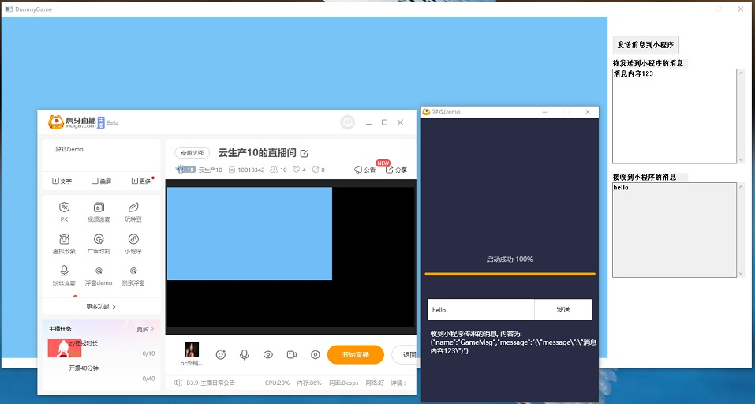
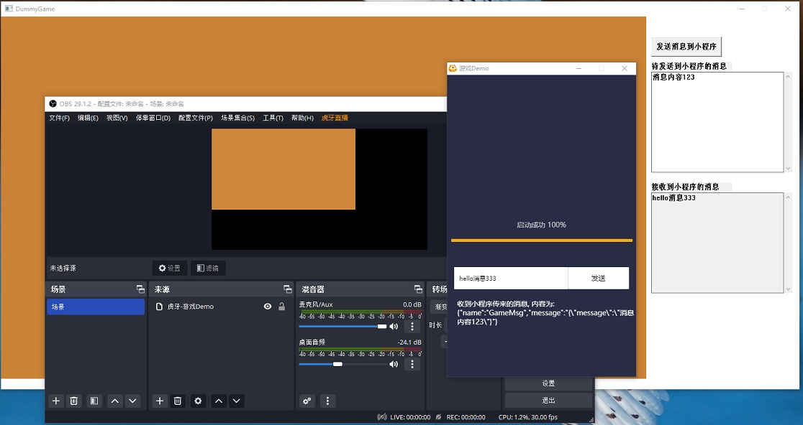

# 项目(GameDemo)演示游戏接入CPPSDK，投射图层到主播端流程

## 1 游戏类型
* 不限引擎类型，支持UE4、Unity、Cocos、自研等多引擎
* Demo展示

* 小程序版本配置勾选"自动发布OBS"即支持OBS环境

* [示例小程序链接](https://appstore.huya.com/#/app/59ku7pqm)

## 2 运行平台
* PC Windows环境 64bit 编译环境: cmake3.63+、vs2017+
* 体验Demo:复制thirdparty/ControllerSDK/bin/win64的所有依赖文件到bin目录，运行GameDemo.exe

## 3 基础玩法
### 3.1 初始化环境参数
* 通过环境变量获取cpp_jobid、cpp_port、cpp_listen_port、local_log_dir等必要参数
### 3.2 初始化SDK
* 调用cpp_context_init3(cpp_jobid, cpp_jobid, local_log_dir, cpp_listen_port, false); 完成初始化
* 调用cpp_set_custom_data_cb注册回调，解析CustomData获取主播端预览分辨率
* 调用cpp_set_channel_msg_cb注册回调, 用于监听小程序和主播端的消息
* SDK接口参数请参照thirdparty/ControllerSDK/include/ControllerAPI.h
### 3.3 采集游戏图像发送
* 生成一个流名（可自定义唯一即可），调用UpdateAnchorLayer绑定流名和图层名
* 调用sdk发送流接口发送游戏图像，支持三种数据发送:
* cpp_pipeline_add_texture_jce 发送D3D11Resource纹理对象(推荐)
* cpp_pipeline_add_dx_texture_jce 发送共享纹理句柄(推荐)
* cpp_pipeline_share_raw_jce 共享内存发送像素数据
### 3.4 处理消息互动
* 通过cpp_call_channel_msg发送业务消息
* 解析业务消息实现互动
* [业务消息接口文档](game_interface.md)
## 4 进阶玩法
### 4.1 多图层投射
* 举例游戏里调用了cpp_pipeline_add_texture_jce发送了两个场景图像:对应流名streamUUID为GameDemo-local-13310-1, GameDemo-local-13310-2; 
* 调用UpdateAnchorLayer，参数layerList[0]设置stream_name:"GameDemo-local-13310-1"，opt_layer_name:"游戏Demo"，参数layerList[1]设置stream_name:"GameDemo-local-13310-2"，opt_layer_name:"游戏Demo#场景1"，这样就会在主播端展示两个图层，其中"游戏Demo"为主要图层，"游戏Demo#场景1"为子图层
* 子图层最多为5个，命名规则为"主图层名"+"#"+"用途"构成，主图层名要求与小程序名一致
## 5 发布部署
* 如本样例所示，本样例的输出为GameDemo.exe，发布时只需要把GameDemo.exe和游戏资源压缩成zip包，然后在小程序开放平台素材上传zip包获取url地址，最后在小程序里配置url地址
* 开放平台文档: https://dev.huya.com/docs/miniapp/dev/sdk/
* **注意: 本项目thirdparty下的所有SDK依赖，在发布的时候不需要进打包，会由主播端提供运行时环境！**
## 6 其他参考
* [本示例关联的小程序](https://github.com/weigod/game_launcher_demo)
* [弹幕玩法云启动全流程介绍](https://dev.huya.com/docs/miniapp/danmugame/intro/)
* [官方推荐小程序Demo在这里](https://github.com/huya-ext/hyext-examples/tree/master/examples/exe)
* [Unity C# Demo示例(见C#_Demo目录)](C#_Demo)

